# Nuclear

**A multi-phase macro placer for VLSI chip design.**
Analytical global placement, bit-exact incremental evaluation, and metaheuristic
search — fused into a single 800-second pipeline that produces zero-overlap
placements on the ICCAD'04 IBM benchmarks.

<p align="center">
  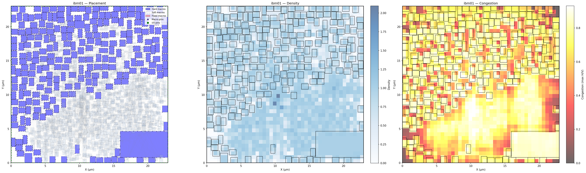
  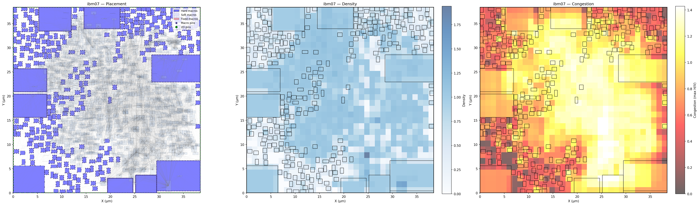
  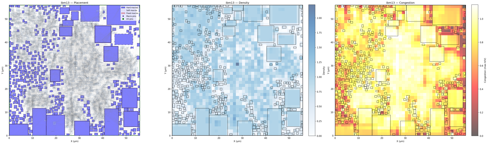
</p>

---

## The problem

Macro placement is the NP-hard problem of arranging fixed-size hard blocks —
SRAM macros, IP cores, embedded memories — on a chip canvas. Every placement
is scored by a weighted sum of three competing objectives:

| Objective | What it measures | How it's computed |
|---|---|---|
| **Wirelength** | total interconnect length | half-perimeter bounding box of every net's pins (HPWL) |
| **Density** | spatial pile-ups | mean occupancy of the top-10% hottest grid cells |
| **Congestion** | routing hotspots | mean of the top-5% smoothed routing demand cells |

The cost function matches Google's TILOS / Circuit Training benchmark — the
same one used in the *Nature* "graph placement with deep RL" paper. Beating it
requires a careful combination of continuous and combinatorial optimization,
because the cost surface is non-convex, non-smooth, and dominated by long-range
interactions.

---

## The pipeline

```
                ┌─────────────────────────────────────────────────┐
  input plc ──> │ α₁ Electrostatic GP   (FFT Poisson, focused)   │
                │ α₂ Soft-Adam          (TILOS surrogate, K=24)  │
                │  0 Legalize           (push-apart + spiral)    │
                │  1 FastEvaluator      (bit-exact, ~2 ms/move)  │
                │  2 Subgradient        (central diff, true cost)│
                │  3 Lin-Kernighan      (k-opt chains + sweeps)  │
                │  4 Regional LAHC      (R = 3 → 5 → 7)          │
                │  5 Global LAHC        (late-acceptance polish) │
                └─────────────────────────────────────────────────┘ ──> positions
```

Every phase oracle-verifies via the reference `compute_proxy_cost` and only
commits zero-overlap results. The legalized input is treated as a **safety
floor** — if no phase beats it, the input wins by default. The placer is
incapable of regressing.

### Phase-by-phase

| # | Phase | Innovation | Budget |
|---|---|---|---|
| α₁ | **Focused-Poisson Electrostatic GP** | 2D FFT Poisson solver — a density hotspot at (5, 5) generates a *global* field, not just a 4-neighbour gradient. Only the top-10% cells contribute to the source term. | 60 s |
| α₂ | **K-batched TILOS-faithful Adam** | Soft macros descend a differentiable surrogate (LSE-smoothed HPWL + density + RUDY congestion); hard macros stay locked at their α₁ positions. Top-K candidates oracle-ranked. | 220 s |
| 0 | **Vectorized legalizer** | Pairwise-overlap push-apart with O(N²) batched math, then a spiral fallback for stragglers that the sweep can't resolve. | 5 s |
| 1 | **FastEvaluator** | NumPy reimplementation of `PlacementCost.get_cost`. Validated bit-exact on `ibm01`. Incremental updates run **~2000× faster** than the oracle. | 10 s |
| 2 | **True-cost numerical subgradient** | ∂proxy/∂x_i via central differences on the bit-exact proxy. No surrogate gap — descends the *actual* cost, the gap that typically limits analytical GP. | 60 s |
| 3 | **Lin-Kernighan k-opt** | Chained swap moves of depth 4 + 5×5 slide sweeps, ranked by neighbour-list scoring, accepted only against the bit-exact proxy. | 150 s |
| 4 | **Hierarchical regional LAHC** | Mini-LAHC restricted to each region of an R×R grid (R = 3 → 5 → 7), with the exterior frozen. The per-region subproblem has so few DOFs that the polish reaches configurations a global LAHC pass would never sample. Has a multi-start GPU variant with K parallel chains. | 130 s |
| 5 | **Global LAHC polish** | Late-Acceptance Hill Climbing with mixed move types: random slides, neighbour swaps, soft-macro centroid-bias, and congestion-decongest proposals. | 130 s |

---

## Key innovations

### Focused density target
Classical ePlace tries to push *every* grid cell toward uniform density. But
the cost function only penalizes the top-10% cells — so most of the
electrostatic force is spent fighting density gradients that don't matter.

This placer's Poisson source term is `density − top_10pct_threshold`, clamped
at zero. Only hotspots emit a field. The whole optimization concentrates
exactly where the cost function is sensitive.

### FFT global potential
The density gradient in DREAMPlace is local — each cell feels only its 4
neighbours. A hotspot at (5, 5) has no idea there's empty space at (50, 50).

A 2D FFT Poisson solver computes the *global* density potential: every cell's
field is a sum of contributions from every other cell, weighted by `1/r²`.
Macros at (5, 5) get pushed by emptier regions across the whole canvas.

### Bit-exact NumPy proxy
The reference cost function (`PlacementCost`) takes ~4 seconds per evaluation
— far too slow to drive a search loop. The FastEvaluator is a NumPy reimplementation
that's been validated bit-exact against the reference on `ibm01` and other
benchmarks. Single-macro moves run in **~2 ms** via incremental cache updates.
That's a 2000× speedup, which is what makes LK, LAHC, and regional polish
feasible at all.

### True-cost subgradient
Phase α₂ computes the per-macro gradient by **finite differences on the
FastEvaluator**:

  ∂proxy/∂x_i ≈ (proxy(x_i + ε) − proxy(x_i − ε)) / (2ε)

Four FastEvaluator calls per macro = ~8 ms per stochastic update.  No
surrogate, no LSE smoothing, no gamma annealing — just Adam on the true cost.
This closes the surrogate-truth gap that bottlenecks analytical GP.

---

## Results

Visualizations of placements produced by the pipeline on the ICCAD'04 IBM
benchmark suite (`ibm01` – `ibm18`):

<p align="center">
  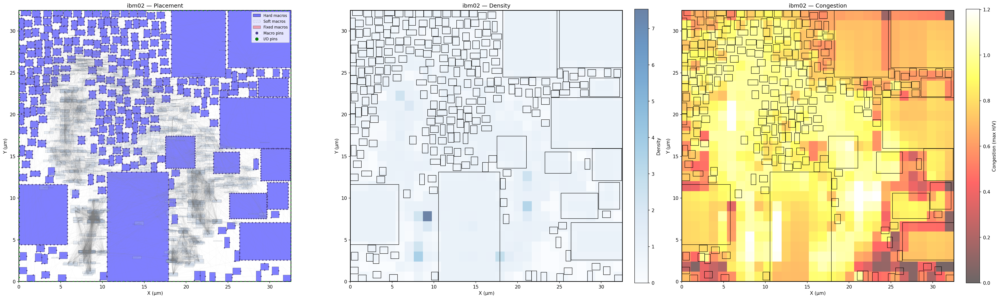
  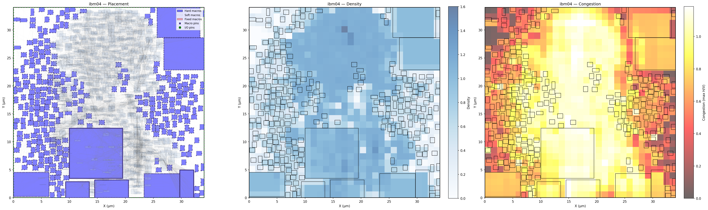
  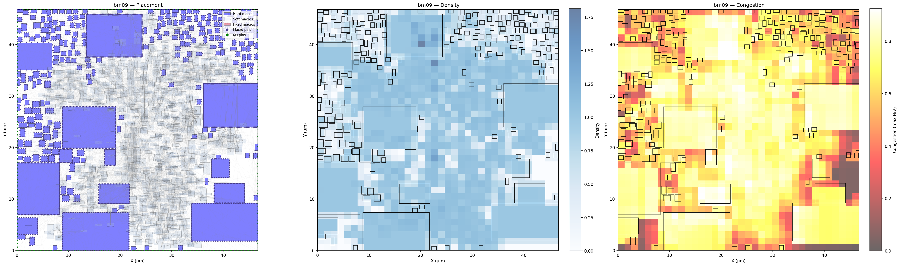
  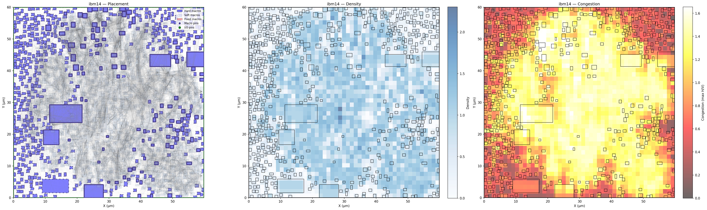
</p>

<p align="center">
  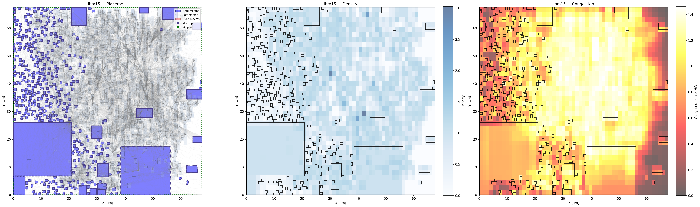
  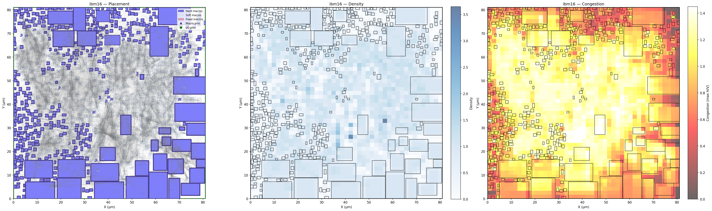
  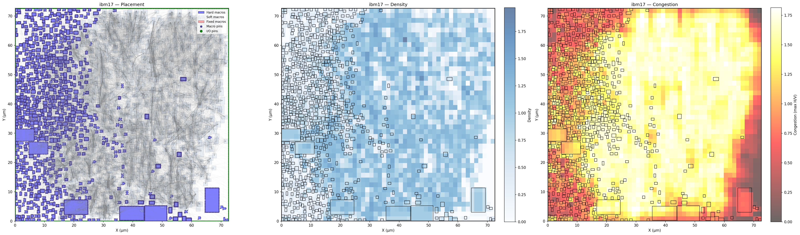
  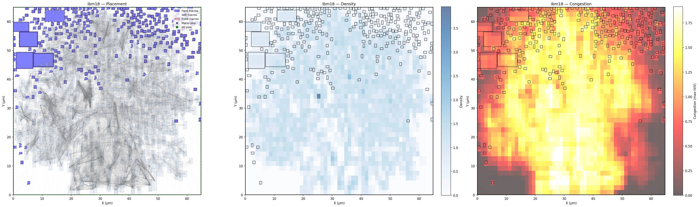
</p>

Full set under [`images/ibm/`](images/ibm/).

---

## layout

```

mise_en_place/             # French for "everything in its place" — the placer
├── pipeline.py            GraphGradPlacer    main pipeline orchestrator
├── lk_pipeline.py         LKPlacer           five-phase variant
├── gp.py                  Phase α₁           focused-Poisson electrostatic GP
├── legalize.py            Phase 0            push-apart + spiral legalizer
├── evaluator.py           Phase 1            FastEvaluator (bit-exact, incremental)
├── subgradient.py         Phase α₂           true-cost stochastic subgradient
├── lk.py                  Phase 2            Lin-Kernighan k-opt
├── cong_attack.py         Phase 2.5          direct congestion attack
├── lahc.py                Phase 3            LAHC polish
├── regional.py            Phase 4            hierarchical regional LAHC (CPU)
└── regional_gpu.py        Phase 4            multi-start parallel chains (GPU)
└── images/
    └── ibm/                   ICCAD'04 IBM benchmark visualizations
```

---

## Usage

```python
from mise_en_place.pipeline import GraphGradPlacer

placer = GraphGradPlacer(
    seed=42,
    time_budget_s=800,
    gp_pop_size=8,
    soft_K=16,
    lk_passes=2,
    regional_grid_sizes=(3, 5, 7),
)
positions = placer.place(benchmark)
```

`benchmark` is a `macro_place.benchmark.Benchmark` from the surrounding
ICCAD'04 / NanGate45 loader framework.

### Requirements
- Python 3.9+
- PyTorch (CUDA optional, required only for the GPU regional polish)
- NumPy
- `macro_place` framework (benchmark loader + reference oracle)

---

## Background

This implementation builds on a lineage of placement work:

- **ePlace** (Lu *et al.*, 2015) — electrostatic analogy for analytical placement
- **DREAMPlace** (Lin *et al.*, 2019) — GPU-accelerated analytical placement
- **TILOS / Circuit Training** (Google, 2020) — the proxy cost function this work targets
- **Lin–Kernighan** (Lin & Kernighan, 1973) — classic k-opt local search
- **LAHC** (Burke & Bykov, 2008) — Late Acceptance Hill Climbing
